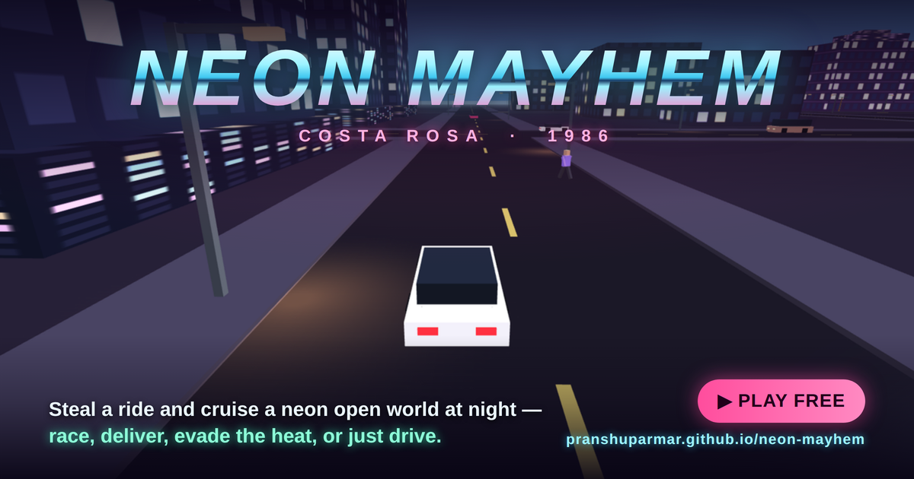

# NEON MAYHEM

**Costa Rosa, 1986.** Two islands, one channel, no loading screens. Steal a ride, outrun the heat, run a taxi shift till the clock bleeds you, buy a condo with the takings, and sleep off the stars while the sun jumps eight hours. Or just cruise the beachfront at night with the radio on.

<p align="center">
  
</p>

<p align="center">
  <b><a href="https://pranshuparmar.github.io/neon-mayhem/">▶ PLAY NOW — free, in your browser</a></b>
</p>

A free, fan-made, browser-playable open-world tribute inspired by Grand Theft Auto: Vice City (2002). Everything in the project is original work — the sentence you just read is the only place the original game is named. No build step, no server, no accounts, no ads. Progress saves to `localStorage` and the whole thing runs offline.

## The city

- **Isla Rosa**, the neon mainland — a ~1 km² seeded city, identical on every visit: the Ocean Strip with its shops and casino pier, Centro Alto's towers, Puerto Viejo's harbor, Las Colinas — plus a curving beach, boardwalk, piers, a spinning ferris wheel, an airport, and an animated ocean under a full day/night cycle with a **live 24-hour clock** on the HUD.
- **Isla Verde**, locked across the channel — close enough to leave a silhouette in the fog, far enough to keep its secrets. Beat four marked missions — or find every stunt jump — and the two bridges (and the airspace over them) open. Over there the land *rises*: two hills, a switchback to a lookout, a resort road, a coastal ring — curves, not a grid — with bungalows on the slopes and the island's only skyline down by the port.
- **Landmarks that read like landmarks:** the casino is a pier palace with a sunburst marquee and roving searchlights, the hospitals wear glowing cross towers and EMERGENCY canopies, the police stations hang blue lanterns, the lighthouse sweeps a real rotating beam, the observatory wears a copper dome — and the marina glitters with string lights down every jetty.
- The world is alive around you: jackable traffic, pedestrians, parked cars, all simulated in a bubble that follows the player. Crossing a bridge changes the traffic stock around you as well as the scenery.

## Drive, fly, fall

- Arcade driving with handbrake drifts across a garage's worth of machines: cars, vans, taxis, ambulances, cruisers, a motorcycle and superbike, a dune buggy, a stretch limo, an ice-cream truck, a monster truck — all with 3-stage damage (smoke → fire → boom) and honest fire warnings before anything explodes.
- A **helicopter** and a **light plane**, flyable with loops and barrel rolls. The plane's takeoff run is real — about 66 meters of engine haul before the nose comes up, so you'll want the actual runway — and a stalled airframe recovers by *diving*, not throttling. Bail out of either mid-air and a **parachute** opens.
- **25 hidden stunt jumps** on roadside ramps, a third of them boosted. Air time, distance and spins all pay. Find all 25 for $50,000, the full arsenal with unlimited ammo, and a monster truck that jumps on command.

## The law

- A 0–5 star wanted system that escalates from pursuing cruisers to foot pursuits, roadblocks, spike strips and visible air units — searchlight, strobes, tracer and all.
- Four **respray garages** (three mainland, VERDE MOTORS on the island) repair and recolor the car for $100 — and fresh paint fools a patrol, so up to two stars die with the old color. From three up they know your *face*, and paint stops helping.
- That's when you see the **desk sergeant**: losing the top star of a deep warrant costs more than shaking off a fender-bender ($150 a star at one star, $750 at five), and CLEAN SLATE wipes the whole ladder for exactly the sum of its steps. No discounts, no traps. (Or sleep it off at home — free, if you can spare eight hours.)

## Work

- **Street races** against rivals who drive what *you* drive, **timed couriers** with fresh drops every run, and **rampages** — each opening with a fade-out and a big 3-2-1 countdown before you're let loose.
- Continuous **taxi, paramedic and ice-cream shifts** that level up: more people, further out, marked by floating arrows. The clocks are tuned as a high-score run, not a loop you can hold forever — early fares bank a little, the mid-shift breaks even, the deep shift bleeds. The ice-cream round works backwards: nobody waits for you, the chimes pull them to the hatch.
- Isla Verde carries four missions of its own, and they stay on the island — nothing asks you to cross mid-run.
- Finish something worth finishing and a shareable **result card** is drawn for it — save it, copy it, or send it to your phone's share sheet.

## Money, property, style

- **GRAN ROSA MOTORS** — a glass showroom with display cars on spotlit pads and a rotating totem. Every vehicle is on the floor from day one, helicopter and TALON gunship included; money is the only gate. Every purchase is a deed: **a fresh copy of your fleet waits at the showroom and at every property you own.**
- **Three properties** — a dockside flat, a strip condo, a marina villa across the channel. Own one and you wake up at home after a hospital-grade night, gear intact. **SLEEP IT OFF** actually sleeps: eight hours cross the clock, the sky moves, the law forgets you, and your health comes back.
- **THE LUCKY GULL** casino on the pier — three stakes, a wheel that really spins, and a gull that usually wins.
- **THREADS** and **CORTES CUTS** — shirts, pants, cuts, hair colors and skin tones, previewed on a mirror that shows *you*, exactly as you stand, before a dollar moves.
- **ROSA HARDWARE** (and VERDE HARDWARE across the channel) sells armor, medkits and iron — and street weapon racks restock only once per in-game day, so the counter matters.

## The feel

- 3 procedurally generated radio stations — every note synthesized at runtime with the Web Audio API, with slow synth pads over the title screen.
- The title screen is a live broadcast: the city simulates behind the menu with spectator camera cuts until you press start.
- A heading-up radar minimap; a full map (`P`) with legend, POI badges, pickups and street-following mission routes — click anywhere to set a destination.
- CRT filter, separate music/SFX switches, and a day/night pin if you want the city permanently at golden hour or midnight (a night's sleep politely overrules it).

## Controls

| Input | On foot | In car |
|---|---|---|
| W A S D | Move | Throttle / steer / brake |
| Mouse | Camera | Camera |
| RMB / Tab | Aim (lock-on) | — |
| LMB | Fire | Fire (drive-by w/ SMG) |
| Q / E | Cycle lock target | Drive-by left/right (barrel roll in a plane) |
| Space | Jump | Handbrake |
| F | Enter / jack car | Exit car |
| J | — | Start the shift a working vehicle offers |
| 1–5 | Weapon select | — |
| , / . | — | Radio station |
| Shift | Sprint | — |

`P` map & routing · `M` mute · `T` CRT filter · `H` hide hints · `R` respawn/skip · `Esc` pause · `⛶` fullscreen

**In the air:** helicopter — climb with `Space`, descend with `Shift`, tilt with `W/S`, yaw with `A/D`. Plane — `W` to roll down the runway, `Space` to rotate once you're fast, `Q/E` to barrel-roll, and pull hard enough on the elevator for a full loop. `F` bails out with a parachute.

📱 **On phones and tablets** touch controls appear automatically: a floating stick under the left thumb, a context-sensitive action cluster under the right — buttons appear only when they apply — with the radar and PAUSE along the top. Starting the game enters fullscreen and asks for landscape.

## Run it locally

Serve the folder from any static host (GitHub Pages works as-is):

```
python3 -m http.server 8000
# open http://localhost:8000
```

The only network request the game ever makes is an anonymous visit count (see [Analytics](#analytics)), skipped entirely when you run it locally or offline.

## Tech

Plain non-module scripts sharing globals, loaded in dependency order — runs from `file://` or any static host. The world is a *list of landmasses*: every water test, height lookup, spawner and route asks the list, so Costa Rosa's grid and Isla Verde's curves are the same thing to everything above them. Island roads are polylines with a grading solver — sample the terrain, relax along each road and across every junction, cap the grade — so a road laid down later is drivable by construction rather than hand-tuning. Three.js r128 (MIT, see [THREE.LICENSE](THREE.LICENSE)) is vendored at `js/lib/three.min.js`. Instanced/merged geometry, distance fog, a spawn/despawn bubble, and a z-fight-audited ground stack keep it at 60 fps on mid-range hardware. A scriptable test API is exposed at `GAME.test`, and every change ships only after headless verification through it — a claim `test/smoke.js` (run by CI on every push) holds the game to: boot, a clean console, zero network requests when served locally, and a geometry count that stays flat under heavy spawn churn.

## Analytics

The published site counts visits and a handful of anonymous events — things like a session started, a mission or shift finished, a stunt jump found, a wanted level reached, aircraft flown, the bridges opened, a shop purchase made, a result card saved or shared — via [GoatCounter](https://www.goatcounter.com/): cookieless, no identifier stored in the browser, and nothing about you kept. `js/analytics.js` is a thin wrapper that silently no-ops when the counter is blocked or unavailable, so the game never depends on it. It is skipped entirely on `file://`, `localhost` and LAN addresses — a local or offline copy makes no network request at all.

## Disclaimer

Fan-made tribute. Not affiliated with Rockstar Games or Take-Two Interactive. No original game assets used. All city names, brands, characters, and music in this project are invented; audio is synthesized at runtime.
